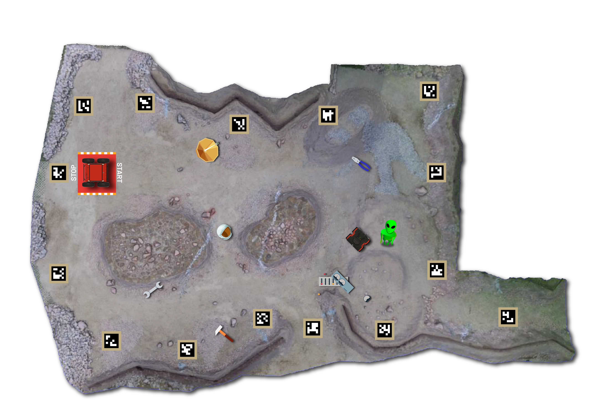
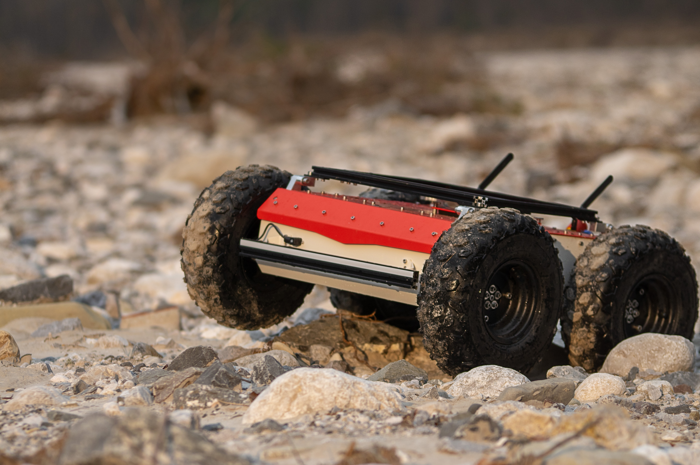
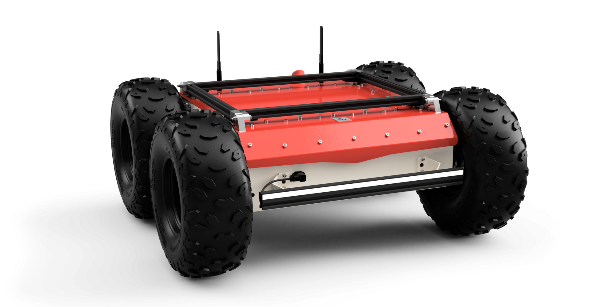
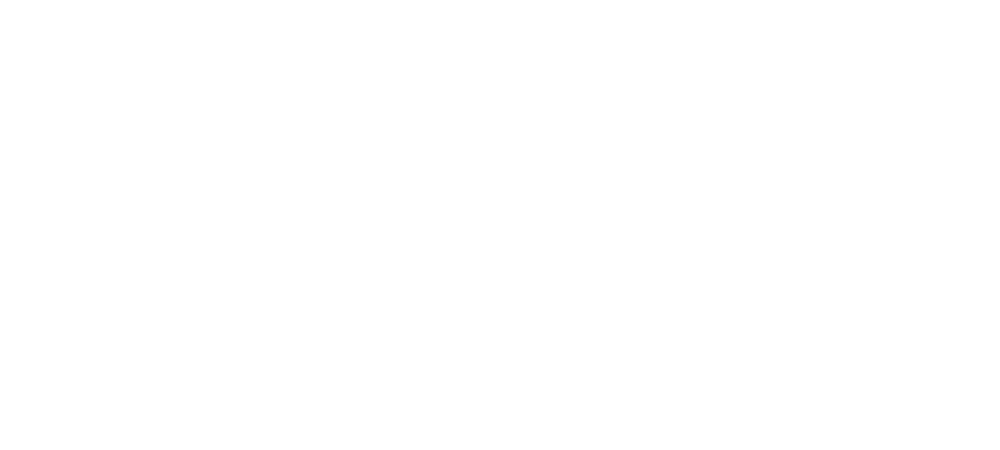
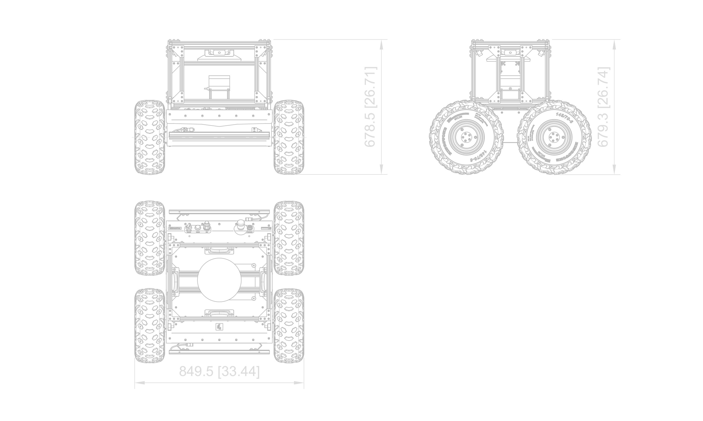
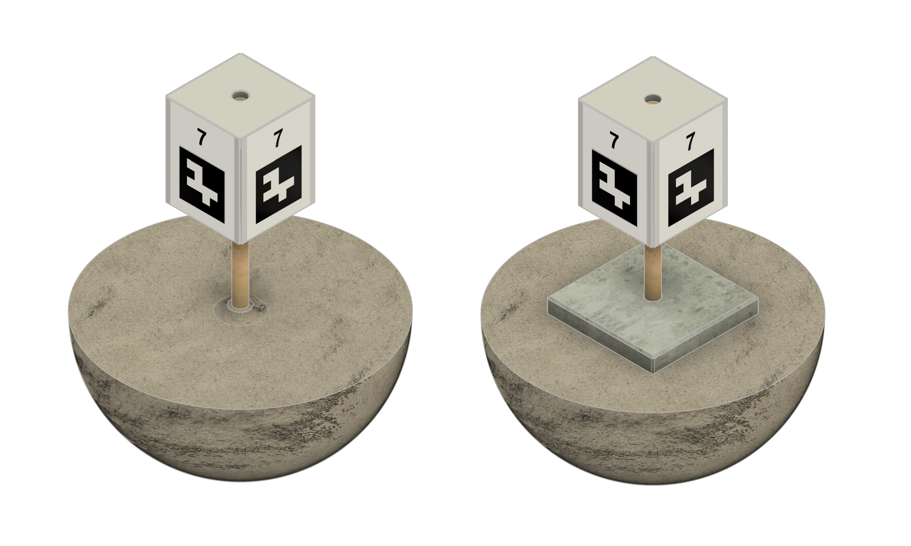
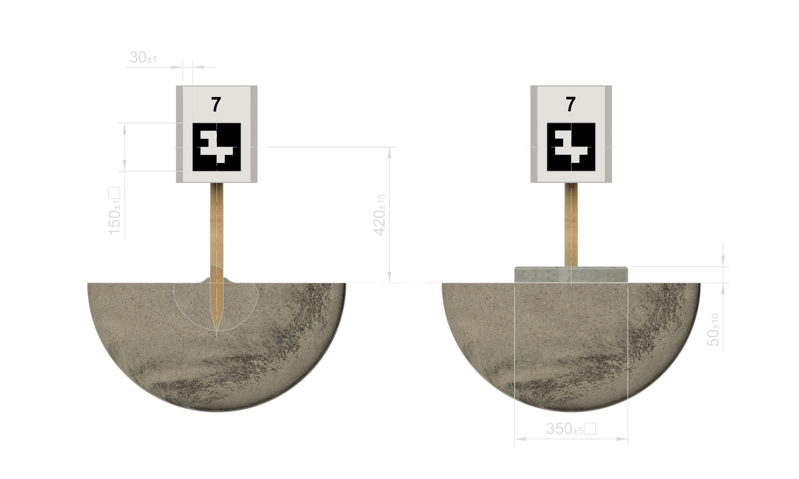

# CRISS Robotics '26 Software - Probation Challenge

## Setup Instructions

### Create workspace

```bash
mkdir ~/husarion_ws
cd ~/husarion_ws
git clone -b ros2 https://github.com/husarion/husarion_ugv_ros.git src/husarion_ugv_ros
```

### Configure environment

```bash
export HUSARION_ROS_BUILD_TYPE=simulation
```

### Build

``` bash
vcs import src < src/husarion_ugv_ros/husarion_ugv/${HUSARION_ROS_BUILD_TYPE}_deps.repos

sudo rosdep init
rosdep update --rosdistro $ROS_DISTRO
rosdep install --from-paths src -y -i

source /opt/ros/$ROS_DISTRO/setup.bash
colcon build --symlink-install --packages-up-to husarion_ugv --cmake-args -DCMAKE_BUILD_TYPE=Release -DBUILD_TESTING=OFF

source install/setup.bash
```

## Important Topics 


## About the Challenge - Exploration Task



### Operation

Intention here is to create a setup where the robot autonomously navigates through the Marsyard and returns to the starting point after mapping the whole available area. Throughout the Marsyard there will be multiple Landmarks meant to be found and documented by the robot. Marsyard will be surrounded by a series of Markers that are meant to limit the area available for the autonomous operation.

Some parts of the Marsyard will be **unreachable to the robot** (especially autonomously) - because of the steep terrain. Unreachable areas inside the outer perimeter will **not** be guarded by the Markers. Competitors MUST be aware of such parts and any attempts of reaching such areas MUST be limited (i.e. by the number of attempts, time spent, etc.). Safety measures SHOULD be described to the Judges at the beginning of the Challenge and their states MUST be communicated live to the Judges during any risky manoeuvres. This includes both encouraging and discouraging the Judges from triggering any overrides based on the Team's confidence in any given situation.

> [!TIP]
> All Landmarks meant to be found will be visible from the ground level, so it'd make sense to i.e. incorporate other sensors available (like the built into the base platform IMU) and limit the allowed angles of the robot's movement based on the data from those sensors. This data can be later integrated to i.e. the cost-map used for the navigation - to prevent it from wasting time trying to climb hills.
>
> IMU may also be used for detecting things like - being stuck on rocks, etc. Such cases, when handled properly (i.e. by notifying the Contestants/Judges about the situation) MAY be scored positively in categories like Technical Excellence.

### The robot

<!---->




You'll also find 3D data of the robot in `models` directory of this repository.

> [!NOTE]
> Have in mind that the images above are showing only the base of the used robot. Additional equipment will be mounted on op of it during the Competition. Those pictures may later be updated to show the actual configurations used during the Competition.
<!-- TODO PIC Panther modded diagrams -->

Robot configuration available to the Competitors:

- [Husarion Panther](https://husarion.com/manuals/panther/overview/) - the base platform with extended battery
- 4xRGB camera (front, back, left, right) - Full HD, 30FPS, ROS driver controlled by the Operator, calibrated, publishing raw and compressed (MJPEG) images
- LSLIDAR C16 - ROS driver controlled by the Operator

On top of that some extra items will be added for other purposes:
- Some sort of safety-basket for sensors - the exact shape is undetermined at this point as we're aiming for one that does not obstruct the cameras' view while also minimizing the risk of damaging them upon collision
- [PAD02](https://husarion.com/manuals/panther/panther-options/#pad02---radiomaster-tx16s) - RadioMaster TX16S - to be used by Judges to manually control the robots in between Contestants and on their request. There will be some control override mechanism to suit that need and Competitors MUST adhere to any technical requirements it imposes. Exact control override mechanism will be provided later.

### Markers




Near the boundaries of the Marsyard there will be a series of Markers placed. The role of those Markers is two-fold - first to provide clear features for visual systems and also to provide a way of limiting the area available for the autonomous operation.

The number of markers will be between 10 and 50.

These Markers will have a high-contrast (black and white) digital tags on them (think QR/ArUco). Each of the tags will have a number as it's content. The tag right behind the robot in it's starting position will contain the highest available number. From the robot's perspective the numbers will be getting lower by 1 per tag in the clockwise direction - meaning that the tag behind the robot, on the right side will be `0`, and on the left, `n-1`. Contestants MAY or MAY NOT use this information in their algorithms.

The Markers won't be placed right at the physical boundary of the Marsyard, but rather some distance from it, on the inner side. The intention for that is to provide some lee-way for the robots, Contestants and the Judges when it comes to the safety behaviour. This way - the robots SHOULD NOT the virtual wall between any two Markers with consecutive numbers (soft-limit) but such position will still be within the area that they MUST NOT leave (hard-limit).

> [!NOTE]
> Some of the Markers will be placed in spots unreachable to the robots, especially operating autonomously. The algorithms provided by the Contestants MUST be aware of it and MUST NOT try to reach any fixed distance from the Markers.
>
> Markers will NOT be placed at the same height relative to the starting orientation of the robot - some of them will be placed on the hills surrounding the Marsyard. Competitors MUST take this into account when planning their algorithms.

Contestant MAY use the Markers in the maps created as a result of the Challenge. Contestants MAY present the Judges with any internally generated figures (like the geometric figure created by the Markers found during the Challenge) as a part of the Technical Excellence rating.

### Landmarks

Landmarks are the main items to be found during the Challenge. Landmarks will represent a couple of categories (like tools, infrastructure, items out of place, etc.) - Competitors MAY choose not to name the categories in their reports but SHOULD be aware that there will be Landmarks not typical to the Mars environment present during the Challenge, and they SHOULD note that in their reports in the descriptions of the respective items.

> [!IMPORTANT]
> Landmarks will be placed in the Marsyard in a way that they are visible to the robot operating from the ground level. Due to the viewing angles available the backgrounds will vary - from the Marsyard's surface to the sky. Competitors SHOULD plan for both cases (i.e. by using contours as an additional method of recognition).

Geological features MAY be included in the Landmarks by the Competitors however this is NOT the main goal for this Challenge. Landmarks added on top of the ones prepared for the On-site competition will be rather physical object oriented and NOT a soil or a rock.

> [!TIP]
> We will NOT be targeting only items from any popular object detection libraries. Some of them will certainly fit into such categories, but some of them will be less obvious and MAY require some additional processing to be recognized.
>
> The distinction we're aiming for is choose items vastly different from the ground and rocks already available on the Marsyard. We will be targeting the items that are on the large side (both in general and in terms of any given item), possibly with colors that are very distinct from the ground.
>
> Publishing a set of URDFs for proposed items on the Community Forum may get you some Community Excellence points ;-)

### Structure of the resulting data

Resulting file should be a PDF report that first outlines the general findings and then goes into details about each of the Landmarks found. For any data volume suggestions we're assuming page size of A4 and a font readable after printing on a regular household printer. Template for such report will NOT be provided, however the Contestants MAY use the Community Forum to validate their intermediate results.

The general findings section SHOULD include a map of the Marsyard with the path taken by the robot and the Landmarks (possibly Markers) found. In case of a map there MAY be some sort of a coordinate system specified. Any other data (like an LLM summary of the drive) MAY be included provided that it's value can be clearly understood by the reader. This section is expected to be at most a single page long.

Each of the Landmarks found SHOULD be presented on a separate **single** page. Descriptions of the Landmarks SHOULD contain:
- a photo of the Landmark
- a textual description of the Landmark
- the location of the Landmark (ideally with a map with a point on it and NOT a plain numerical GPS location)
- any other data that the Competitors find justified

Textual description of a Landmark SHOULD contain not only a vague description of an item but also a clear section of it's relation to the environment it was found in (i.e. whether the presence of such item on Mars is probable, whether it may be useful in the following steps of the mission, etc.).

> [!TIP]
> We're only aiming for the structured PDF reports because of the ease of scoring. We will not be judging any intermediate steps of the data processing, as long as they are not affecting the final results. Competitors MAY use any tools available to them to create such reports, including any tools that are not ROS 2 based - i.e. one can simply add a "Take snapshot" button to the control panel, that will save all the camera images, locations, etc to a directory and then use any other data processing pipeline for analysis and creation of final report. TLDR - staring in the ROS world does not mean that you have to limit yourself to it.

## Competition Report

Competition Report does not have any technical requirements on top of the ones specified in the Rulebook.


